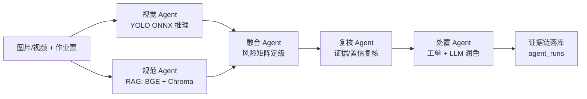
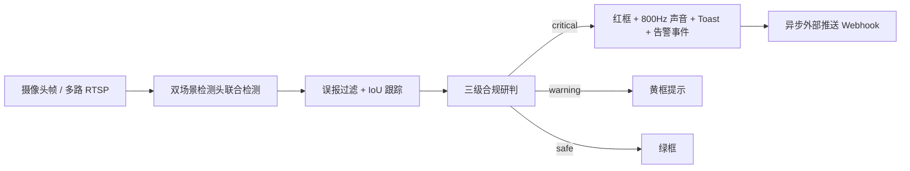

# 海之子 · 动火作业安全多 Agent 智能体

> 当前覆盖**动火作业**与**施工 PPE** 两个场景的本地化安全智能体：支持**上传研判**（多 Agent 重链路）与**实时摄像头监测**（轻链路）双模式，全程零外网依赖，可离线部署。

一套从「视觉感知 → 规范检索 → 风险定级 → 闭环处置 → 人工纠偏 → 复训回写」端到端打通的工地安全智能体，兼顾**研判深度**（多 Agent 协同、RAG 条款引用、证据链可追溯）与**告警时效**（实时链路首帧出警、规则驱动、无阻塞推理）。

## 核心特性

- **双模式**：上传研判走多 Agent 重链路（深度推理、可读工单），实时监测走轻链路（低延迟、连续预警）。
- **多场景检测**：当前覆盖动火作业（火花/烟雾/灭火器）+ 施工 PPE（安全帽/反光衣/人员/堆放物倾斜）两个场景，检测头按场景配置可扩展。
- **三级合规**：红（不合规/即时高危）/黄（警告）/绿（合规），分级规则数据驱动，可不改代码调整。
- **多 Agent 编排**：视觉 ∥ 规范 → 融合 → 复核 → 处置，线程并行 + 超时降级 + 证据链落库。
- **本地 RAG**：BGE 中文 Embedding + ChromaDB 向量检索，规范条款语义匹配、可引用条款号。
- **可选本地 LLM**：Ollama `qwen3:8b` 润色处置文案，断网/不可用自动降级为模板，主链路不受影响。
- **人工纠偏闭环**：改判/逐目标纠偏 → 反馈样本落库 → 审核 → 生成候选训练数据 → 复训回写。
- **告警生命周期 + 外部推送**：高危帧自动创建告警事件、证据截图留存、异步推送到企业微信/钉钉/通用 Webhook，按 `(source, cls)` 冷却去重。
- **模型版本管理**：版本注册、新旧指标对比、一键切换（管理端 UI）。
- **工程化**：服务层权限校验、审计日志、统一测试/启动脚本、Docker 容器化、GitHub Actions CI。

## 系统架构

### 上传研判 · 多 Agent 重链路



- 视觉与规范 **线程并行**预检（`ThreadPoolExecutor`，视觉 3s / 规范 2s 超时降级）；
- 规范 Agent 先只查作业票，拿到视觉证据后再补一次 RAG 条款检索，避免重复跑完整规范链路；
- 每个 Agent 的输入/输出摘要、状态、耗时、异常写入 `agent_runs` 表，供协同追溯与答辩演示。

### 实时监测 · 轻链路



- 实时态只做 检测 → 规则合规 → 告警，**不调用 RAG / 不生成工单**，满足低延迟连续监测；
- 首帧 `critical` 当帧出红框、声音与告警事件，无多帧确认门控；
- IoU 跟踪分配稳定 ID 与连续帧数（仅作元数据，不阻塞告警）；
- 同源同类短时间重复告警按冷却自动去重，持续违规可周期性再报。

## 检测能力（当前双场景）

| 场景 | 检测类别 | 模型 | 推荐阈值 |
| --- | --- | --- | --- |
| `hot_work` 动火作业 | 火花 / 烟雾 / 灭火器 | YOLOv8s ONNX `yolov8_fire_smoke_v*.onnx` | 0.30–0.35 |
| `construction_ppe` 施工 PPE | 安全帽 / 未戴帽 / 反光衣 / 未穿衣 / 人员 | YOLOv8 ONNX `ppe_yolov8_v*.onnx` | 0.25 |
| `construction_ppe` 堆放物 | 堆放物 / 倾斜 | OpenCV DNN YOLOv3 `yolov3-personload.*` | 0.10 |

堆放物倾斜检测为 Detecting-danger 独门能力，按场景开关接入，仅启用一次。场景配置见 `config/config.yaml` 的 `scenes.*`，检测白名单与中文释义见 `core/yolo_engine.py` 的 `WHITELIST` / `WHITELIST_CN`。

## 三级合规

| 级别 | 颜色 | 含义 |
| --- | --- | --- |
| 不合规 | 红 | 即时高危（火花/烟雾/未戴安全帽/堆放物倾斜等），红框高亮 + 声音警报 |
| 警告 | 黄 | 需关注（易燃物/未穿反光衣/堆放物等） |
| 合规 | 绿 | 无违规目标或仅检出安全信号（已佩戴安全帽/反光衣/人员在场） |

分级规则数据驱动，见 `config/config.yaml` 的 `compliance.severity`，键为项目隐患键，值为 `safe/warning/critical`，可在不改代码的前提下调整。

## 多 Agent 职责

| Agent | 角色 | 职责 | 是否调模型 |
| --- | --- | --- | --- |
| 视觉 | 巡检员 | YOLO 逐帧/逐图检测，映射违规中文描述 | ✅ YOLO ONNX + YOLOv3 DNN |
| 规范 | 资料员 | 作业票字段检查 + RAG 规范条款检索与匹配 | ✅ BGE Embedding + Chroma（第二趟） |
| 融合 | 安全主管 | 风险矩阵查表定级 + 误报过滤（火花低置信/矛盾框） | ❌ 纯规则 |
| 复核 | 质检员 | 高风险低置信项/条款未命中 → 标记人工复核 | ❌ 纯规则 |
| 处置 | 督办员 | 组装整改工单 + 工人白话提示（模板为主，LLM 可选润色） | ⚠️ LLM 可选，降级为模板 |

编排器 `agents/orchestrator.py`：DAG 为 `[视觉 ∥ 规范] → 融合 → 复核 → 处置`，顶层 try/except 兜底，任一 Agent 崩溃标红不退出进程，整体状态取 `failed > degraded > success`。

## 经典 QA（设计取舍）

> 下面这些「为什么这么设计」的问题，答案都能在代码里找到依据，不是话术。

**Q1 为什么分「上传研判重链路」和「实时监测轻链路」两条路？**
答：两条链路的优化目标根本不同。上传态追求**研判深度**——多 Agent 协同、RAG 条款引用、证据链落库、工单闭环，可以接受 3–8s；实时态追求**告警时效**，首帧 `critical` 必须当帧出红框+告警。`core/realtime_engine.py` 的 `analyze()` 注释写死了实时不变量：「analyze 与告警之间不得插入 LLM/RAG/工单等阻塞推理，首帧 critical 即返回，无多帧确认门控」。用一套链路同时满足两个目标，必然两头不讨好。

**Q2 实时轻链路为什么没必要接入 Agent 编排或大模型？**
答：四个原因，都来自代码而非推断——
- **帧率预算**：实时每帧只有几十 ms 预算，LLM 单次生成秒级、RAG 检索百 ms 级，塞进去直接打穿「采样节奏 ≠ 告警 SLA」，事故发生了告警还没出；
- **确定性优先**：实时态要的是「检出 spark/smoke → critical → 出警」这种 100% 可重复的判定，不是创造力；LLM 的「润色」对告警判定零增益，反而可能把置信度 0.3 的火花判成「安全」；
- **编排开销×帧率=纯浪费**：Agent 编排（`ThreadPoolExecutor`、超时降级、progress 推送）是为一次性深度研判设计的重设施，每帧跑一次编排等于把固定开销乘以帧率；
- **代码佐证**：`realtime_engine.py` 全程不 import `llm_engine`/`rag_engine`/`agents`，`analyze()` 只调 `core/compliance.py` 的 `evaluate()`（纯规则查表）+ `core/false_positive.py` 过滤 + `core/tracker.py` 跟踪。需要「说人话」的处置建议，已在告警落库后异步做（见 `action_agent.polish()` 后台线程），不阻塞帧。

**Q3 上传链路里，融合 Agent 和复核 Agent 为什么不引入 LLM？**
答：因为这两个环节做的是**影响处置动作的硬决策**，必须可解释、可审计、可复现，而 LLM 天然不可解释。
- **融合 Agent**（`agents/fusion_agent.py`）：职责是「查风险矩阵取最高等级 + 误报过滤」，是查表 + 阈值比较（`core/false_positive.py` 的 PPE 矛盾框/烟雾-反光衣冲突）。LLM 在这里只会引入幻觉，把确定性的「spark 置信度 0.3 < 0.55 → 判光斑误报」变成不可预测的猜测；
- **复核 Agent**（`agents/review_agent.py`）：职责是「高风险/低置信/证据不足 → 标记人工复核」，判定逻辑是确定规则（`cls ∈ HIGH_RISK_CLASSES` 且 `conf < 0.55`）。规则没覆盖的本来就该交人工，让 LLM 拍板「要不要复核」反而增加不可解释性、模糊审计边界。
- 安全系统铁律：定级、是否复核这类硬决策用规则；LLM 只做不影响判定的软任务（文案润色，见 Q4）。两个 Agent 全程无 `llm_engine` import。

**Q4 那 LLM 到底用在哪？为什么只用在这一处？**
答：**只用在处置 Agent 的「工人提示文案润色」**（`agents/action_agent.py` 的 `polish()`），且是工单落库后异步后台线程，不进 ≤8s 主链路。理由：把规范条款 + 整改要求翻译成一线工人听得懂的大白话是生成式任务，规则写死会僵；但润色结果不影响 `risk_level`/是否告警，`llm_engine.polish()` 返回 `None` 即自动降级为模板，主链路零影响。现状（已在「后续优化计划」标注）：`orchestrator` 当前未注入 `work_order_dao`，`polish()` 早返回，LLM 处于「接线待通」状态，主链路跑模板。

**Q5 视觉与规范为什么要并行 + 两阶段 RAG？**
答：并行是为了压总时延，两阶段是为了省一次向量库往返。
- **并行**：视觉 3s / 规范 2s 用 `ThreadPoolExecutor` 并行 `submit` + `future.result(timeout)` 精确超时，总链路压在 ≤8s，超时转 `degraded` 不崩进程（`agents/orchestrator.py` 的 `_safe()`）；
- **两阶段 RAG**：规范 Agent 一阶段只查作业票字段（快），拿到视觉违规描述后再补一次 RAG 条款检索（视觉 `violation_descs` 回灌 `rule`）。避免每张图都跑一次完整规范检索，`skip_rag` 标志控制是否触发第二趟（`agents/rule_agent.py`）。

**Q6 为什么用本地 Ollama 而不是云端大模型 API？**
答：工地常无外网，断网/内网必须可用；`core/llm_engine.py` 仅与 `localhost:11434` 通信，`available()` 健康检查不过就返回 `None` 触发模板降级，主链路不依赖 LLM。同时规范数据不出工地，合规与隐私安全。这是「可选增强、断网降级」而非「核心依赖」。

**Q7 为什么视觉推理用 ONNX Runtime 而不是直接 PyTorch？**
答：部署免装 `torch`/`ultralytics` 重栈，ONNX Runtime 跨平台、`intra_op` 线程可控、`run()` 释放 GIL 利于多头并行。实时引擎按 `cpu // 引擎数` 封顶 `intra_op_threads` 防抢核（`realtime_engine.py` 的 `_compute_intra_op()`），实测小模型线程过多反而更慢。

**Q8 误报过滤为什么用规则而不是让 LLM 判别？**
答：`spark` 低置信光斑、PPE 矛盾框（同一人既 `helmet` 又 `no_helmet`）、烟雾-反光衣冲突，都是确定性的逻辑冲突，规则秒判且可解释；LLM 逐帧判误报会吃掉帧率预算，还会把可解释的「为什么过滤」变成黑盒。代码在 `core/false_positive.py` 的 `filter_ppe_contradiction` / `filter_smoke_vest_conflict`。

**Q9 实时态为什么堆放物检测要降频（`lod_interval_sec`）？**
答：堆放物倾斜是**慢变量**，不需要每帧跑；火花/烟雾等关键头仍每帧跑保证即时告警，堆放物检测按 `lod_interval_sec` 节流、间隔内复用上次结果，把慢头从「每帧求和」里摘出。这是「关键路径全速、非关键路径节流」的典型工程取舍（`realtime_engine.py` 的 `detect()`）。

**Q10 模型切换为什么不自动顶替线上、要手动确认？**
答：安全系统里新模型 mAP 提升不等于所有现场场景都更优，自动顶替有回退风险。当前设计：复训完 `register(active=False)` 不立即激活 → 展示新旧 mAP 对比 → 人工「一键切换」 → `model_service.switch()` 回写 `config.yaml` + `_reload_running_engines()` 热加载，留出对比和回滚窗口（见 `ui/page_admin.py`）。

## 人工纠偏闭环

- 安全员改判或逐目标纠偏后自动写入 `feedback_samples`（`pending`）；
- 管理端可审核 `pending / confirmed / rejected`；
- `scripts/build_feedback_dataset.py` / `scripts/prepare_feedback_training.py` 将确认样本生成场景级 YOLO 候选训练数据；
- `scripts/export_feedback.py` 可导出 CSV；
- `ui/correction_workbench.py` 提供可视化逐目标纠偏工作台（原图 + 检测框 + 修正框）。

## 告警与外部推送

- 高危帧自动创建告警事件 → 现场标注帧截图留存（`data/alarms/`）→ 异步推送到企业微信/钉钉/通用 Webhook；
- 推送结果写 `notification_logs` 留痕（sent / failed / skipped），管理端可测试推送并追溯；
- 支持多路 RTSP 后台自动轮询（`monitor.*` 配置），按 `(source, cls)` 冷却去重，持续违规可周期性告警；
- 默认关闭，配置见 `config/config.yaml` 的 `notify.*` / `monitor.*`，详见 `docs/notify-flow.md`。

## 模型版本管理

- 管理端复训任务支持启动/轮询/早停/导出 best.pt 为 ONNX，训练完成自动注册到模型版本表（`active=False`，不动当前线）；
- 新旧指标对比展示，可一键切换为当前版本；
- `scripts/register_model.py` / `scripts/switch_model.py` 为命令行注册/切换入口；
- `scripts/evaluate_models.py` 在测试集上计算各隐患类别 Precision/Recall/F1，写入 `data/eval/model_eval.json`。

## 目录结构

```
hzz-fire-safety/
├── app.py                  # Streamlit 入口（st.navigation 多页路由 + 全局主题）
├── run_tests.ps1           # 统一全量测试
├── run_app.ps1             # 统一应用启动
├── Dockerfile / docker-compose.yml  # 容器化部署
├── .github/workflows/ci.yml         # 自动测试
├── config/
│   ├── config.yaml         # 全局与多场景配置（权重/类别映射/三级合规/告警/监控）
│   └── rules/              # 各场景风险融合矩阵（hot_work / construction_ppe）
├── core/                   # 最底层：推理引擎与工具
│   ├── yolo_engine.py      # YOLOv8 ONNX 推理（文件/帧两种输入）
│   ├── load_object_detector.py  # 堆放物检测 + Hough 倾斜判定
│   ├── compliance.py       # 三级合规研判（数据驱动）
│   ├── realtime_engine.py  # 实时轻链路：多场景头联合检测 + 绘图
│   ├── tracker.py          # IoU 目标跟踪（稳定 ID + 连续帧数）
│   ├── false_positive.py   # 误报过滤（PPE 矛盾框 / 烟雾-反光衣冲突）
│   ├── rag_engine.py       # BGE Embedding + ChromaDB 向量检索
│   ├── llm_engine.py       # 本地 Ollama LLM（可选，自动降级）
│   ├── config.py / pdf_parser.py / video_utils.py / video_source.py / yolo_adapter.py
├── agents/                 # 多 Agent 编排（视觉/规范/融合/复核/处置/编排器）
├── services/               # 认证/审计/任务/权限/模型/监控/通知/导出/训练/知识库
├── dao/                    # SQLite 持久化（models.py + schema.sql）
├── ui/                     # 页面（login/upload/realtime/agents/report/history/admin/diag/theme）
├── scripts/                # 数据准备、训练、评测、纠偏、模型注册/切换脚本
├── docs/
│   ├── specs/              # P0–P6 阶段规格
│   ├── development-complete.md
│   └── defense-materials.md
├── data/
│   ├── models/             # 推理权重（ONNX/.weights/.cfg/.names）
│   ├── kb/ uploads/ exports/ alarms/ train/  # 运行期生成目录（多为 .gitignore 忽略）
│   └── app.db              # SQLite（运行期生成）
└── tests/                  # 单元/集成/e2e/反馈闭环/告警生命周期/权限/模型注册测试
```

## 快速开始

```bash
# 依赖（离线优先，见 requirements.txt）
pip install -r requirements.txt

# 启动（默认监听 0.0.0.0:8501）
.\run_app.ps1

# 全量测试
.\run_tests.ps1
```

应用启动后默认进入登录页。内置演示账号见 `scripts/seed_demo.py`，权限分层（普通安全员/管理员）由 `services/permission_service.py` 强制校验。

页面导航（`st.navigation` 侧边栏）：上传与作业票 📤 → 多 Agent 研判 🤖 → 工单/改判/导出 📋 → 实时摄像头监测 📷 → 检测历史与分析 📊 → 管理端 ⚙️ → 系统自检 🩺。

实时摄像头页面使用 `st.camera_input` 零依赖轮询方案：点击捕获帧即检测并展示，开启「连续监控」后自动刷新等待下一帧；**声音警报仅在实时监测态、且不合规时触发**。页面同时支持多路 RTSP / 本地视频源按帧抓取。

## Docker / CI

```bash
# 构建并启动容器（默认 8501）
docker compose up --build

# 容器内运行全量测试
docker compose run --rm app python -m pytest tests -q --tb=short -p no:cacheprovider
```

`.github/workflows/ci.yml` 会在 push / pull request 时于 Ubuntu 上安装中文字体并运行全量测试。

> 构建说明：Dockerfile 使用 `python:3.13-slim-bookworm`，并将 apt 源切到 `mirrors.aliyun.com`，避免 `deb.debian.org` 在当前网络环境不可用导致构建失败。

## 配置说明

全局配置见 `config/config.yaml`，主要段落：

| 段 | 作用 |
| --- | --- |
| `models` | 默认火情模型路径与类别映射 |
| `kb` | 规范 PDF 目录、Chroma 集合与持久化路径 |
| `infer` | 置信度/NMS 阈值、抽帧参数、堆放物检测间隔、ONNX 线程上限 |
| `llm` | 本地 LLM 开关、Ollama 地址、模型名 |
| `scenes.*` | 各场景检测头列表 + 知识库集合 + 风险矩阵 + 堆放物开关 |
| `compliance.severity` | 隐患键 → safe/warning/critical 分级 |
| `notify` | 外部推送开关/通道/webhook/冷却 |
| `monitor` | 后台 RTSP 轮询开关/采样间隔/源列表 |

场景化后优先读 `scenes.<scene>.yolo_weights`，单模型兜底读 `models.yolo_onnx`。

## 模型评测基线

```bash
.\.venv313\Scripts\python.exe scripts\evaluate_models.py --thresholds 0.25 0.30 0.35 0.45
```

脚本会在火情与 PPE 测试集上计算各隐患类别的 Precision/Recall/F1，并把结果写入
`data/eval/model_eval.json`。当前基线显示 `no_helmet`（未戴安全帽）和 `no_vest`
（未穿反光衣）召回率偏低，是后续数据补采和重训的优先项。

## 后续优化计划

### 检测模型与 mAP
- 当前 `no_helmet`（未戴安全帽）、`no_vest`（未穿反光衣）召回偏低（见评测基线），是数据补采与重训的优先项；
- 阈值与 NMS 调参空间尚存，`spark` 低置信光斑误报过滤阈值（`fp_filter.spark_conf_min`）可按现场继续收敛；
- 人工纠偏确认样本经 feedback 闭环周期性回写微调，提升长尾/夜间/逆光等场景召回。

### 新场景检测头扩展
- 当前为动火作业 + 施工 PPE 双场景，后续按建筑施工「五大伤害」逐步扩展检测头：
  - 高处坠落：安全带（系/未系）+ 临边洞口防护栏杆/盖板在位判定；
  - 临时用电/触电：裸露线缆、违规配电箱、电线拖地涉水；
  - 吸烟/明火源：施工区禁烟 + 易燃物共存；
- 动火子场景补齐 `face_shield`（防护面罩）与 `flammable`（易燃物）检测头——两者已声明接口，仅缺权重，补齐即闭合动火合规链路；
- 复用现有训练流水线 `prepare_combined_dataset → train_combined → export → register → switch`，每新增一场景对应一份 `scenes.<scene>` + `config/rules/<scene>.yaml` + 知识库集合。

### 链路与工程闭环
- **处置 Agent LLM 接线**：当前 `work_order_dao` 未注入 `ActionAgent`，导致本地 LLM 润色为死代码、工单提示恒为模板；接上 DAO 后工单提示可升级为润色文案；
- **上传研判异步化**：引入后台执行器 + 进度轮询，主线程提交即返回，进度从「事后轨迹」变为「真·实时」；

### RAG 知识库与文档解析
- 当前 RAG 仅接受**文本型 PDF**（`core/pdf_parser.py` 经 PyMuPDF `get_text` 抽取，无 OCR），扫描件/图片型 PDF 抽出为空、无法入库；
- 扩展加 **OCR 预处理层**（PaddleOCR 或 Tesseract）先对扫描件做文字识别，再走现有条款切分 + 向量入库流水线；
- 扩展**格式归一化层**：`docx`/`doc`/`txt`/`md` 等非 PDF 文档统一转纯文本后入向量库，`import_pdf` 接口泛化为 `import_doc`；
- 条款号正则（`第X条`/`X.X.X`/`一、`）对非法规体例文档命中率低，需补充章节标题/段落启发式切分策略。

### 其他
- **命名收口**：当前名称「动火作业安全」仅覆盖一道工序，随场景扩展往「建筑施工安全」方向收敛，动火作为子场景；
- **告警事件 → 异步 Agent 增强**：高危告警状态跃迁时后台补跑 RAG 条款 + LLM 处置建议回写告警记录，不阻塞实时帧；
- **RTSP 采样与告警 SLA**：火情关键源 `monitor.interval_sec` 建议 ≤3s，必要时改连续抓帧入队模型，明确「采样节奏 ≠ 告警 SLA」。
## 部署注意

- `.gitignore` 已忽略：`data/raw/`、`data/combined/`、`data/eval/`、`data/feedback_training/`、`data/runs_combined/`、`data/kb/chroma/`、`data/kb/*.pdf`、`data/uploads/`、`data/exports/`、`data/app.db*`、`__pycache__/`、`*.pyc`、`.venv313/`、`plugins/`、官方 `yolov8n.pt`/`yolov8s.pt` 及 `data/models/BAAI--bge-small-zh-v1.5/`。
- 仅小体积推理权重（`.onnx`/`.weights`/`.cfg`/`.names`）纳入版本库；大模型 Embedding（`BAAI--bge-small-zh-v1.5`）与原始数据集需另行分发，勿入库。
- 知识库（RAG）需联网或本地模型首次构建后离线可用；实时监测态不依赖知识库。

## 技术栈

- **前端**：Streamlit（原生 `st.navigation` 多页路由）
- **视觉推理**：ONNX Runtime（YOLOv8）+ OpenCV DNN（YOLOv3 堆放物）
- **规范检索**：sentence-transformers（BGE-small-zh）+ ChromaDB
- **本地 LLM**：Ollama `qwen3:8b`（可选增强，断网降级）
- **持久化**：SQLite
- **工程化**：Docker / docker-compose、GitHub Actions CI、PowerShell 统一脚本

## 说明

本项目面向教学/演示场景，识别能力以本地 ONNX 权重为准。PPE 头按 `construction-safety-gsnvb` / industrial-safety-vision 工程路线训练导出，类名须与 `config.yaml` 中 `class_map` 完全一致。`scripts/train_ppe_local.py` 与 `scripts/export_ppe_onnx.py` 为本地训练/导出入口。