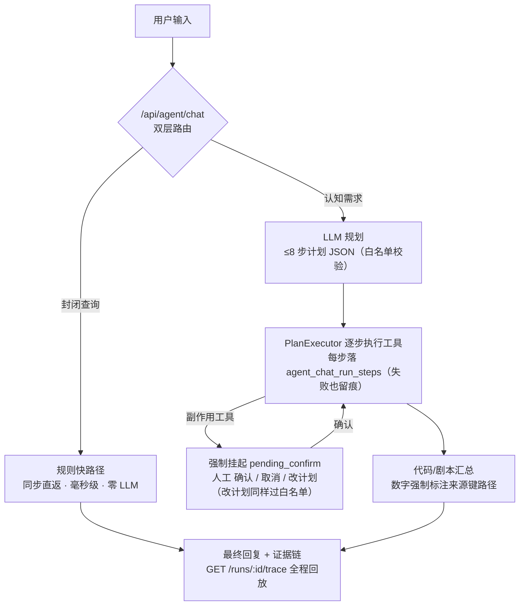
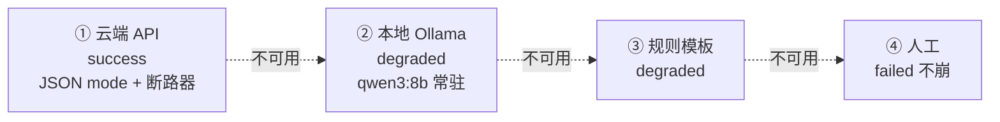
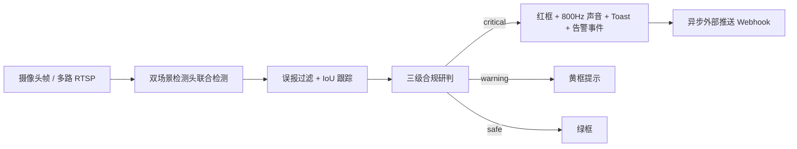
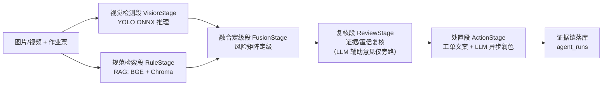

# 02 · 系统架构

> 返回 [README](../README.md) · 上一节 [01 快速开始](01_快速开始.md) · 下一节 [03 功能与页面](03_功能与页面.md)

**建筑安全领域的多模态智能体**：眼睛（YOLO 视觉感知：图片 / 视频 / RTSP 实时流）→ 大脑（受限 Plan-and-Execute 认知层）→ 手脚（6 个注册工具嵌完整工单闭环）→ 边界（定级规则查表、副作用人工确认）。一套从「视觉感知 → 规范检索 → 风险定级 → 闭环处置 → 人工纠偏 → 复训回写」端到端打通的体系，兼顾**研判深度**（五段流水线研判、RAG 条款引用、证据链可追溯）与**告警时效**（实时链路首帧出警、规则驱动、无阻塞推理）。

## 对话认知 · Agent 认知层（v2.1）

系统**唯一的顶层 LLM 智能体**：受限版 Plan-and-Execute——LLM 只在「规划」「汇总」两点出场，中间执行确定性。



**LLM 四级降级链**（列表序即降级序，`degraded ≠ failed`，LLM 全灭时判定与告警链路零依赖）：



- 工具白名单：`weekly_report_data / lookup_views / rag_search / run_video_pipeline`（只读）+ `raise_suggestion / create_order_draft`（副作用，需确认）；
- 剧本机制：按意图预置规划/汇总提示词、超时与结果校验——`weekly_report` 剧本数值必须溯源工具 SQL 统计，校验不过落模板档，拒绝 LLM 编造数字；
- 铁律不变：LLM 永不进风险定级，定级保持 `compliance.severity` 查表；
- 上下文与记忆（v2.2）：规划输入 = 近 5 轮摘要 + 本会话最近 2 轮原文（截断 200 字，理解指代）+ 跨会话记忆（用户最近 2 个其他会话的要点，标注"非本轮指令"）；`agent.memory_enabled/memory_sessions/recent_turns` 可配；
- 会话恢复：页面刷新后未完结 run（执行中/待确认）自动恢复实时气泡，确认卡不丢失。


## 统一 LLM 入口（云端优先）

`core/chat_client.py` 单一入口四级降级链（列表序即降级序）：

1. **云端 API**（openai SDK 接 OpenAI 兼容端点，JSON mode + 墙钟预算 + 断路器）——正常态 `success`；
2. **本地 Ollama** `qwen3:8b`（keep_alive 常驻热调用，`available()` 健康检查）——`degraded`；
3. **规则模板**——`degraded`；
4. **人工**——`failed` 不崩。

`degraded ≠ failed`：LLM 全灭时系统可控衰减，判定与告警链路零依赖 LLM。LLM 只承担不影响判定的生成/分类任务（认知层规划/汇总、工单文案润色、表单预填提取、意图路由封闭集分类兜底），副作用动作（建单草稿/告警建议）强制人工确认、无豁免开关。


## 实时监测 · 轻链路



- 实时态决策链 检测 → 规则合规 → 告警 全程纯规则，**不调用 RAG / LLM、不生成工单**；告警当帧即出，告警落库后异步回填规范条款（非阻塞、不进决策路径）；
- 首帧 `critical` 当帧出红框、声音与告警事件，无多帧确认门控；
- IoU 跟踪分配稳定 ID 与连续帧数（仅作元数据，不阻塞告警）；
- 同源同类短时间重复告警按冷却自动去重，持续违规可周期性再报；
- Phase 4 起后端常驻 **实时 Hub**（`api/realtime_hub.py`）承担视频源推理：后端单推理循环，N 个浏览器经 `/api/ws/realtime` 共享同一路推理，无人观看自动降频保活；与 `monitor.*` 轮询互斥（Hub 优先）。


## 上传研判 · 影像研判流水线（重链路）



- 视觉与规范**线程并行**预检（`ThreadPoolExecutor`，视觉 3s / 规范 4s 超时降级）；
- 规范检索段先只查作业票，拿到视觉证据后再补一次 RAG 条款检索，避免重复跑完整规范链路；
- 每段的输入/输出摘要、状态、耗时、异常写入 `agent_runs` 表（表名为历史命名），供协同追溯与答辩演示；
- **主链路全确定性**：风险定级为规则查表，LLM 仅复核段旁路"辅助理解"意见（不改变定级）与处置段异步润色（失败保持模板）；
- 五段组件命名为 `*Stage`（`pipeline/` 包）：它们是**确定性流水线组件，非 LLM 智能体**——v2.1 起该链路整体降级为认知层的工具层（`run_video_pipeline` 按需调用，判定逻辑不变）。


## 目录结构

```
hzz-fire-safety/
├── app.py                  # Streamlit 入口（st.navigation 多页路由 + 全局主题，回退入口）
├── api/                    # FastAPI 接口层（Phase 2）
│   ├── main.py             # 应用工厂：/api 前缀挂 routers，frontend/dist 静态托管
│   ├── realtime_hub.py     # 实时 Hub：后端唯一推理循环 + WS 帧广播
│   └── routers/            # auth/tasks/alarms/orders/reports/admin/history/media/agent/ws
├── frontend/               # React 前端（Phase 3）
│   ├── src/pages/          # Login/ChatWindow(AI助手)/AgentRun(影像研判)/Orders/MyOrders/History/Realtime/Admin/ChangePassword
│   ├── theme.tsx           # 主题系统：暗色/亮色模式 + 四套主色预设（本地偏好，localStorage）
│   ├── components/         # ChatCards(对话卡片)/CapabilityModal(能力提示)/MediaUploadForm/OrderAskDrawer 等
│   └── dist/               # 构建产物（由 FastAPI 托管；改动前端后 npm run build 重建）
├── config/
│   ├── config.yaml         # 全局与多场景配置（不入 git，从 config.example.yaml 引导）
│   └── rules/              # 各场景风险融合矩阵（hot_work / construction_ppe）
├── core/                   # 最底层：推理引擎与工具
│   ├── yolo_engine.py      # YOLOv8 ONNX 推理（文件/帧两种输入）
│   ├── compliance.py       # 三级合规研判（数据驱动）
│   ├── realtime_engine.py  # 实时轻链路：多场景头联合检测 + 绘图
│   ├── tracker.py          # IoU 目标跟踪（稳定 ID + 连续帧数）
│   ├── false_positive.py   # 误报过滤（PPE 矛盾框 / 烟雾-反光衣冲突）
│   ├── rag_engine.py       # BGE Embedding + ChromaDB 向量检索
│   ├── chat_client.py      # 统一 LLM 入口（云端优先四级降级，v2.1）
│   ├── llm_engine.py       # 本地 Ollama 引擎（认知层本地兜底档复用）
│   ├── bootstrap.py        # 首启自举：建库 + 种子默认账号 + 模型注册
│   └── ...（config / pdf_parser / video_utils / video_source / yolo_adapter / bge_worker 等）
├── pipeline/               # 影像研判五段流水线（视觉/规范/融合/复核/处置/编排器/检测缓存）
│                           #   —— run_video_pipeline 工具的内部实现，确定性组件（*Stage），非 LLM 智能体
├── services/               # 认知/认证/审计/任务/权限/模型/监控/通知/导出/训练/知识库/派发验收/报告
│   └── agent/              # Agent 认知层（v2.1）：Plan-and-Execute 内核/工具注册表/剧本/运行服务（唯一顶层 LLM 智能体）
├── dao/                    # SQLite 持久化（models.py + schema.sql）
├── ui/                     # Streamlit 页面（login/upload/realtime/agents/report/my_orders/history/admin/diag/lab）
├── scripts/                # 数据准备、训练、评测、纠偏、模型注册/切换、运维脚本
├── data/
│   ├── models/             # 推理权重（ONNX）+ BGE 模型
│   ├── kb/ uploads/ exports/ alarms/ train/  # 运行期生成目录（多为 .gitignore 忽略）
│   └── app.db              # SQLite（运行期生成，WAL 模式）
└── tests/                  # 单元/集成/e2e/反馈闭环/告警生命周期/权限/模型注册测试
```


## 数据库表（dao/schema.sql）

`users / tasks / detections / compliances / risks / work_orders / audit_logs / detection_records / agent_runs / feedback_samples / alarm_events / notification_logs / model_registry / kb_docs / chat_sessions / agent_chat_runs / agent_chat_run_steps / chat_messages`（18 表；v2.1 新增后四张认知层表，schema.sql 自动重放 + 缺列自动 ALTER 迁移）。


## 技术栈与轻量选型理由

| 层 | 选型 | 理由（工地场景硬约束倒逼） |
| --- | --- | --- |
| 前端 | React 18 + Vite + AntD | 多角色工作台的组件化/路由/状态管理超出 Streamlit 表达力；构建产物由 FastAPI 静态托管单端口部署 |
| 视觉推理 | ONNX Runtime（YOLOv8） | 免装 torch/ultralytics 重栈（2GB+），单库跨平台，CPU ~211ms/帧满足连续监测 |
| 规范检索 | BGE-small-zh（~100MB）+ ChromaDB | 中文语义匹配优于通用英文模型，CPU 即推理；Chroma 嵌入式落盘免运维 |
| LLM 通道 | 云端 API 优先 + Ollama `qwen3:8b` 兜底 | 云端榨取规划/汇总能力上限；断链只降级认知功能，判定链路不受影响 |
| 持久化 | SQLite（WAL 单文件） | 免服务进程，单机演示不起 PostgreSQL |
| 容器化 | Docker + docker-compose | 单镜像跑完，无需多服务容器编排 |

底层约束：工地网络断网是常态（模型推理与数据链路必须本地完成，C1 收窄语义）；无 GPU 办公本/工控机（全部 CPU-friendly）；告警 SLA 首帧秒级（本地推理 ~211ms + 规则当帧即出）；数据主权（Embedding/检索/存储全本地，云端 LLM 仅接收文本上下文，帧与检测原始数据不外发）；安全容错（LLM 挂走模板、BGE 挂跳 RAG、权重缺跳该头，全链路确定性降级不瘫痪）。
