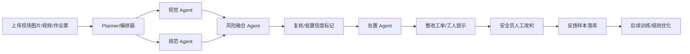

# 答辩材料：工地安全守护多 Agent 智能体

## 一句话定位

面向工地一线工友的安全守护智能体：用视觉 Agent 识别风险、规范 Agent 找到依据、融合 Agent 交叉验证、处置 Agent 生成工单和工人提示，再由安全员人工纠偏并沉淀反馈样本，形成“识别 - 规则 - 定级 - 处置 - 纠偏 - 学习”的闭环。

## 项目故事

建筑工地最危险的问题往往不是“没有规范”，而是规范没有被及时执行。本系统把安全员从重复看监控中解放出来，让智能体先完成检测和证据整理，安全员只做关键确认与纠偏，同时把纠偏结果作为后续模型和规则优化的数据来源。

## 系统架构

## 多 Agent 协同流程

1. 感知视觉 Agent
   - 加载 v2 ONNX 模型；
   - 输出检测类别、置信度、坐标和证据摘要。

2. 安全规范 Agent
   - 检查作业票关键字段；
   - 使用 RAG 检索规范条款；
   - 输出条款引用、合规结论和培训要点。

3. 风险融合 Agent
   - 结合视觉结果与合规结论；
   - 按场景风险矩阵定级；
   - 低置信度火花进入误报过滤。

4. 处置 Agent
   - 生成整改要求、处理时限和工人白话提示；
   - 异步 LLM 润色，不阻塞主链路。

5. 复核 Agent
   - 对高风险低置信度目标、条款未匹配结果标记“需要人工复核”；
   - 复核结果进入处置 Agent，生成更明确的工单提示。

6. 人工纠偏闭环
   - 安全员改判风险等级；
   - 自动记录自动等级、改判等级、原因和来源证据；
   - 管理端可查看并导出 CSV，用于后续训练和规则修订。

7. 告警生命周期
   - 实时高危帧自动生成告警事件；
   - 支持确认、误报、已处理状态流转；
   - 同一会话同一类别短时间重复告警自动去重。

## 证据链设计

每次任务会保存各 Agent 的运行记录：

- Agent 名称
- 执行状态
- 耗时
- 输出摘要
- 异常信息

证据链支持从最终工单反查视觉检测、规范条款、风险理由和处置结果，满足答辩时对“为什么这样判断”的追溯需求。

## 模型与指标

| 模型 | 训练验证 mAP50 | mAP50-95 | ONNX |
| --- | ---: | ---: | --- |
| PPE YOLOv8s | 0.606 | 0.391 | `data/models/ppe_yolov8_v2.onnx` |
| 火情 YOLOv8s | 0.898 | 0.620 | `data/models/yolov8_fire_smoke_v2.onnx` |

独立测试集上：

- 火情：建议 0.30-0.35 阈值；
- PPE：建议 0.25 阈值 + 连续帧确认；
- 残余短板：`person` 召回低，`no_helmet / no_vest` 在 0.45 阈值下召回不足。

## 创新点

1. 本地化多 Agent 协同，不依赖云端推理；
2. 确定性安全内核与 LLM 文案增强分离；
3. 规则 Agent 使用证据绑定，不默认套用第一条；
4. 人工纠偏自动沉淀为反馈样本；
5. 实时链路与上传研判共用统一隐患白名单。
6. 实时告警支持冷却去重，避免短时间重复报警刷屏。
7. 模型版本注册与一键切换/回滚。
8. 逐目标误报/漏报纠偏，可生成 YOLO 候选训练数据。
9. 火情与 PPE 使用独立场景阈值，兼顾精度与误报。

## 演示流程

1. 上传一张工地图片和作业票；
2. 运行多 Agent 研判；
3. 展示证据链：视觉检出、条款引用、风险定级、工单；
4. 演示复核 Agent 标记低置信度高风险项；
5. 安全员改判风险等级；
6. 管理端展示纠偏反馈样本并导出 CSV；
7. 展示实时监测页的连续帧告警与冷却去重逻辑。

## 评委可能问题与回答

### 为什么需要多个 Agent？

因为每个 Agent 解决不同问题：视觉只负责证据采集，规范只负责条款和合规，融合负责交叉验证，处置负责闭环。每个角色有独立输入输出和失败降级，便于审计与改进。

### 低置信度如何处理？

低置信度结果不直接作为重大风险，而是标记为待复核，交给安全员确认。人工确认结果会写入反馈样本。

### 人工纠偏怎么反哺系统？

每次改判会保存自动等级、改判等级、原因和证据来源。管理端可导出 CSV，作为后续训练集扩充、误报分析和规则修订的依据。

### 数据哪里来？

模型使用 Roboflow 公开数据集和本地整理数据训练，类别统一为项目白名单。原始数据保留在 `data/raw`，可复现脚本位于 `scripts/`。

## 评分维度对照

| 评分维度 | 项目对应点 |
| --- | --- |
| 场景创意价值 | 工地安全守护、工友白话提示、整改闭环 |
| AI 协同能力 | 多 Agent 证据链、人工纠偏、反馈样本闭环 |
| 技术创新能力 | 本地 ONNX、RAG 规则、风险融合、可复现评测 |
